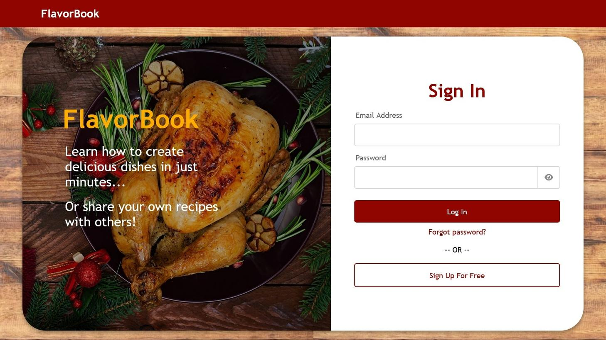

# FlavorBook

<p align="center">
  
</p>

## Project Description
This Recipe Sharing Platform enables users to create, view, and share their favorite recipes. Users can sign up, log in, and manage their personal recipe collections. They can also explore recipes shared by others. Moreover, the platform includes features such as image uploads, pagination, search functionality, and account management.

The platform is ideal for home chefs who want to keep their recipes organized, share their culinary creations, and explore new dishes.

## Features
- **User Authentication** (Sign up, Log in, Log out)
- **Create**, **view**, **edit** & **update**, and **delete** recipes
- **Upload images** for recipes
- **Search** recipes by title, ingredients, and tags
- **Pagination** for large lists of recipes
- **Account management** (delete account with confirmation)
- **View personal recipe** collection via "My Recipes"

## Technologies Used
- **Python (Flask):** Backend framework
- **JavaScript:** Frontend user interface and client-side validation
- **Jinja2:** Templating engine for rendering HTML
- **SQLAlchemy:** ORM for database interactions
- **SQLite:** Database
- **Flask-WTF:** For forms and CSRF protection
- **Flask-Login:** User authentication
- **Flask-Bcrypt:** Password hashing
- **Pillow (Python Imaging Library):** A library for opening, manipulating, and saving many different image file formats
- **HTML, CSS:** For the frontend user interface
- **Bootstrap:** Frontend styling and components

## Installation and Setup
1. **Clone the Repository**
    ```bash
    git clone https://github.com/Seesko/flavor-book-app.git
    cd flavor-book-app
    ```

2. **Create a Virtual Environment and Install Dependencies**
    ```bash
    python3 -m venv venv
    source venv/bin/activate  # On Windows use venv\Scripts\activate
    pip install -r requirements.txt
    ```

3. **Set Up the Database**
    - Create an `.env` file in the project root with the following variables:
      ```
      SECRET_KEY=your_secret_key
      SQLALCHEMY_DATABASE_URI=sqlite:///site.db
      ```
    - Initialize the database:
      ```bash
      flask db init
      flask db migrate
      flask db upgrade
      ```

4. **Run the Application**
    ```bash
    flask run
    ```

5. **Access the App**
    Visit `http://localhost:5000` in your browser to access the application.

## Usage
1. **Sign Up and Log In**
   - Create a new account or log in with your existing credentials.

2. **Create a Recipe**
   - Once logged in, click the "Create Recipe" button in the navigation bar to create a new recipe. Fill out the title, description, ingredients, tags, and optionally upload an image.

3. **My Recipes**
   - Visit "My Recipes" from the user menu to view, edit, or delete any of your previously created recipes.

4. **Search Recipes**
   - Use the search bar to find recipes by keywords in titles, ingredients, or tags.

5. **Account Management**
   - From the settings menu, you can manage your account or delete it entirely.

## Database Schema

The project uses SQLAlchemy ORM for database management. Here’s an overview of the main database tables and their relationships:

### User Table
| Column    | Type           | Description                |
|-----------|----------------|----------------------------|
| id        | Integer (PK)   | Unique user identifier     |
| username  | String         | Username of the user       |
| email     | String         | Email address (unique)     |
| password  | String         | Hashed password            |

### Recipe Table
| Column      | Type           | Description                        |
|-------------|----------------|------------------------------------|
| id          | Integer (PK)   | Unique recipe identifier           |
| title       | String         | Title of the recipe                |
| description | String         | Brief description of the recipe    |
| ingredients | Text           | List of ingredients                |
| preparation | Text           | Preparation instructions           |
| tags        | String         | Optional recipe tags or keywords   |
| image_file  | String         | Filename of uploaded image         |
| user_id     | Integer (FK)   | ID of the user who created recipe  |
| timestamp   | DateTime       | Creation timestamp                 |

### Comment Table (for Recipe Comments)
| Column    | Type           | Description                        |
|-----------|----------------|------------------------------------|
| id        | Integer (PK)   | Unique like identifier             |
| text      | Text           | Content of the user's comment      |
| recipe_id | Integer (FK)   | ID of the recipe being commented on|
| user_id   | Integer (FK)   | ID of the user who commented       |

### Like Table (for Recipe Likes)
| Column    | Type           | Description                        |
|-----------|----------------|------------------------------------|
| id        | Integer (PK)   | Unique like identifier             |
| user_id   | Integer (FK)   | ID of the user who liked the recipe|
| recipe_id | Integer (FK)   | ID of the recipe being liked       |

### Relationships
- A **User** can create multiple **Recipes**.
- A **User** can like multiple **Recipes**.
- A **User** can leave multiple **Comments**.
- A **Recipe** can receive multiple **Comments** from different **Users**.
- A **Recipe** can receive multiple **Likes** from different **Users**.
- A **Recipe** can only be authored by one **User**.
- Each **Comment** is linked to a specific **Recipe**.
- Each **Comment** is linked to a specific **User**.
- Each **Like** is linked to a specific **User**.
- Each **Like** is linked to a specific **Recipe**.


## UI Screenshots

<p align="center">
  
</p>

<p align="center">
  
</p>

## API Endpoints
- **`POST /login`:** Logs in a user with an email and password.
- **`POST /logout`:** Logs out the current user.
- **`POST /delete_account`:** Deletes the current user's account after confirmation.
- **`POST /update_name`:** Updates the current user's username.
- **`POST /update_email`:** Updates the current user's email.
- **`GET /settings`:** Displays the settings page for the current user.
- **`GET /my_recipes`:** Returns a paginated list of the current user's recipes.
- **`POST /create`:** Creates a new recipe.
- **`GET /recipe/<int:recipe_id>`:** Returns the details of a specific recipe.
- **`POST /recipe/edit/<int:recipe_id>`:** Edits an existing recipe (only by the recipe author).
- **`POST /recipe/<int:recipe_id>/delete`:** Deletes a recipe (only by the recipe author).
- **`GET /uploads/<filename>`:** Retrieves the image associated with a recipe.
- **`POST /recipe/<int:recipe_id>/like`:** Likes/unlikes a specific recipe.
- **`POST /recipe/<int:recipe_id>`:** Adds a comment to a specific recipe.
- **`POST /comment/<int:comment_id>/delete`:** Deletes a comment made by the current user.
- **`GET /search`:** Searches for recipes based on title, ingredients, or tags.
- **`GET /`:** Displays the homepage with a list of all recipes.
- **`GET /home`:** Redirects to the homepage.

## Author
Siiko: [Connect with me on LinkedIn](https://www.linkedin.com/in/siiko/)

## License
This project is licensed under an all rights reserved copyright license. Please see the [LICENSE](LICENSE) file for details.
